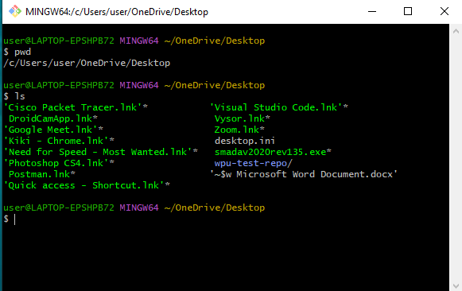
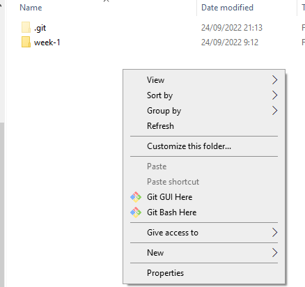
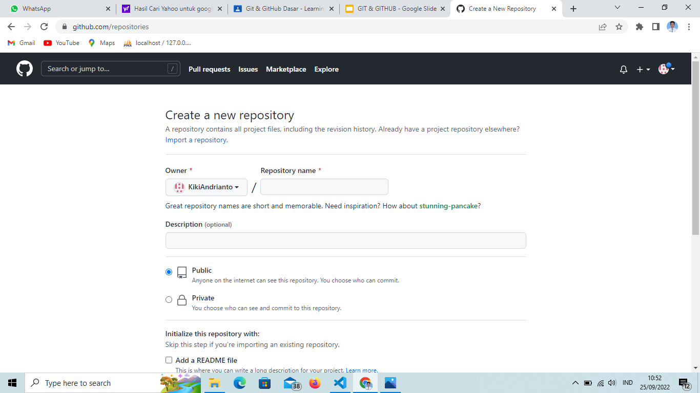
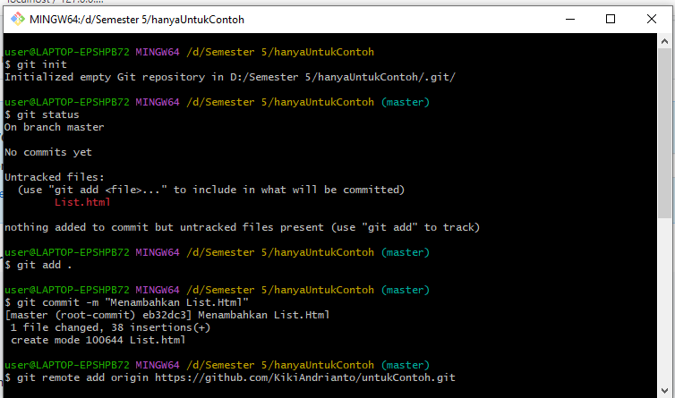
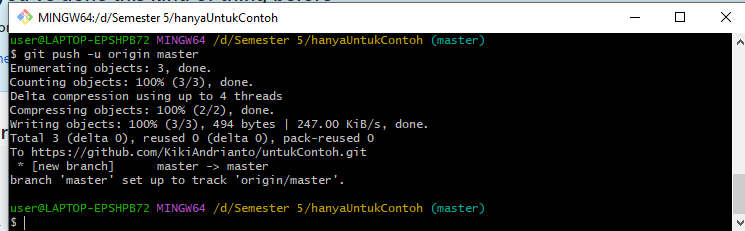
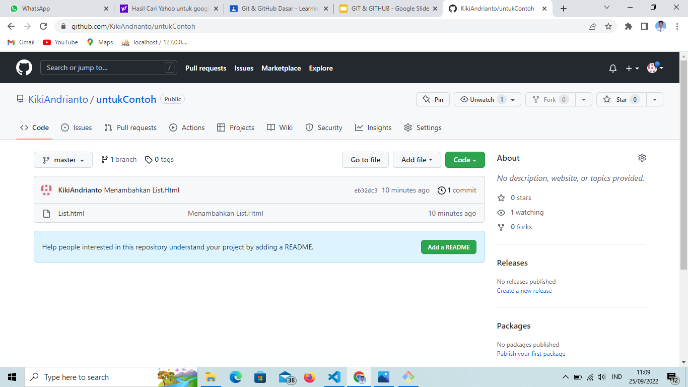
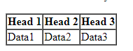
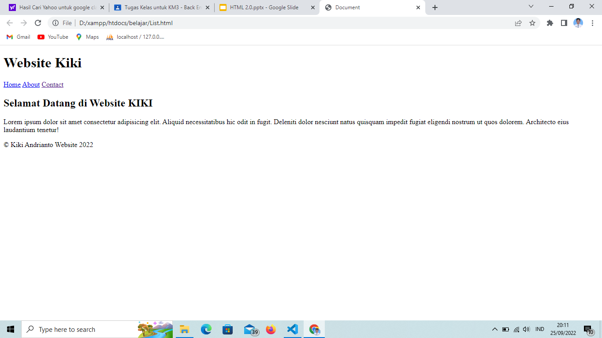
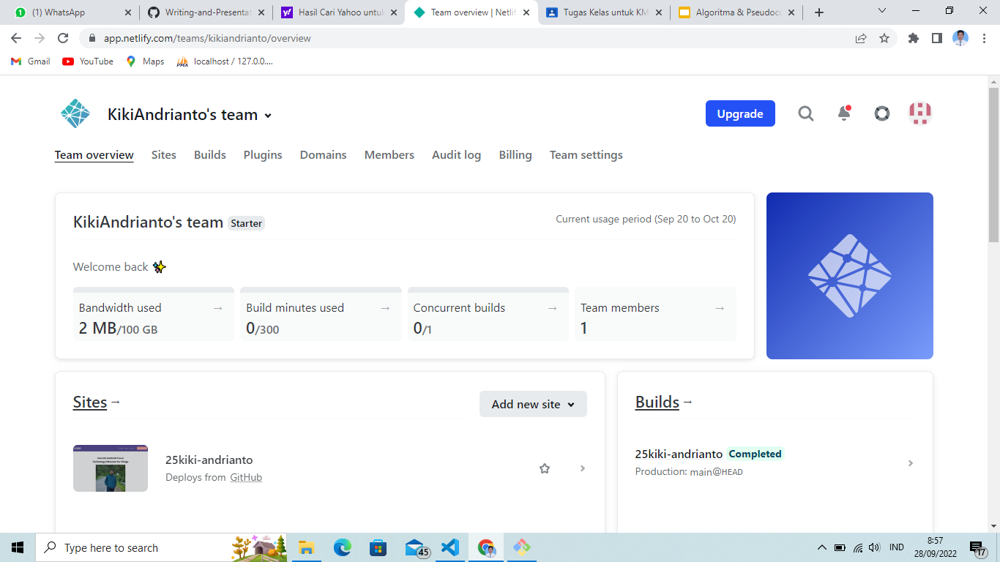
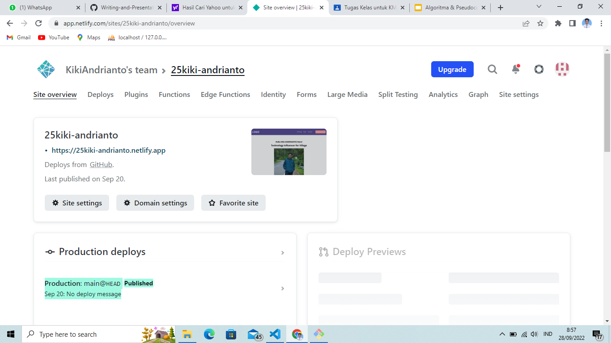

# **Writing and Presentation Test Week 1**

## **Unix Commad Line**

###  **Command Line Interface (CLI)**
  <div align="justify">CLI atau Command Line Interface adalah sebuah program yang memungkinkan user mengetik perintah atau command yang akan mmemerintahkan perangkat komputer untuk melakukan suatu tugas tertentu.

<br>

### **Shell**
  <div align="justify">Shell adalah user interface pengelola CLI dan berperan sebagai perantara yang menghubungkan user dan sistem operasi. Maka dari itu user memerlukan yang namanya shell. Definisi shell secara harfiah sendiri adalah program yang digunakan untuk berkomunikasi atau memerintah sistem.

<br>

### **Terminal**
  <div align="justify">User dan komputer dihubungkan dengan namanya terminal, yaitu tempat/aplikasi dimana user dapat mengetikan atau memberikan suatu perintah. Disinilah tempat dimana shell akan berperan.
  <br>
  Berikut saat pertama kali membuka terminal :

  <br>

### **File System Structure**

  <div align="justify">Struktur dimana mengatur cara bagaimana data disimpan dalam sistem. Contoh dalam Sistem Operasi Windows struktur file yang disimpan menggunakan struktur yang bentuknya mirip sebuah pohon seperti gambar dibawah.

  &nbsp;

  ## Berikut adalah tampilan dari Command Line Interface :

  


- ## Beberapa perintah navigation files dan directory

  - pwd (print working directory), untuk melihat current working directory 
  - ls (list), untuk melihat isi file di dalam directory
  - ls - la ,untuk melihat files yang di hidden 
  - cd (change directory), untuk masuk ke directory tertentu
  - cd .. ,merupakan command untuk berpindah directory
  - mkdir ,digunakan untuk membuat directory baru
  - dir (directory), untuk melihat directory\
  <br>

- ## Beberapa perintah File Manipulation
  - touch, untuk membuat file directory
  - ni, digunakan untuk membuat file di windows
  - cp (copy), untuk menyalin file directory
  - cp -r ,digunakan untuk menyalin directory 
  - mv (move), untuk memindahkan file directory
  - rm (remove), untuk menghapus file directory

  &nbsp;
<hr>

## **Git dan GitHub**
### Perbedaan  Git dan GitHub
- **Git**
  <div align="justify">Git adalah sebuah software berbasis Version Control System (VCS) yang bertugas untuk mencatat perubahan seluruh file atau repository suatu project.

- **GitHub**
  <div align="justify">GitHub merupakan layanan cloud yang berguna untuk menyimpan dan mengelola sebuah project yang dinamakan repository (repo git).
  

### Aladan kenapa Git dan Github tools yang wajib digunakan
  Dengan menggunakan GIT dan Github, kamu akan bisa bekerja dalam sebuat tim. **Tujuan besarnya** adalah kamu bisa berkolaborasi mengerjakan proyek yang sama tanpa harus repot copy paste folder aplikasi yang terupdate.
  Kamu juga tidak perlu menunggu rekan dalam satu tim kamu menyelesaikan suatu program dahulu untuk berkolaborasi. Kamu bisa membuat file didalam projek yang sama atau membuat code di file yang sama dan menyatukannya saat sudah selesai.

&nbsp;

### Langkah bekerja dengan Git untuk mempublish ke GitHub
- Masuk ke dalam git bash dengan cara klik kanan pada file yang akan di      publish lalu klick "Git Bash Here"

  

- membuat Repository dengan masuk ke dalam Aplikasi GitHub

  
- Lakukan beberapa Command di dalam git
  - git init <nama_proyek>, untuk membuat repositori baru

    ```
    git init namarepo
    ```
    <div align="justify">Karena kita sudah membuat repositoy sebelumnya maka kita bisa gunakan ini langsung tanpa harus memberi nama repo baru

    ```
    git init.
    ```
  - git status, digunakan untuk melihat apakah terjadi perubahan atau tidak pada git
    ```
    git status
    ```
  - git add <nama_file>, di gunakan untuk manambah file baru/ menambah perubahan pada file
    ```
    git add namafile   
    ```
    ```
    git add . 
    ```
  - git commit -m "Pesan", di gunakan untuk menyimpan perubahan pada git
      ```
      git commit -m "Pesan"
      ```
  - git remote, digunakan untuk menghubungkan project local yang tlah kita buat ke repository
    ```
    git remote add origin "Link repository pada GitHub"
    ```
  - git push, diguanakan untuk mengirim perubahan file ke remote repository
    ```
    git push -u origin master
    ```

  ### Untuk Tampilan Bekerja Seperti ini
  

  

  ### Hasil Pusblish
  

<hr>
  <br>

## **HTML**

- ### **Penejelasan HTML**
  <div align="justify">HTML adalah singkatan dari Hypertext Markup Language. HTML adalah bahasa komputer yang digunakan untuk membuat kerangka atau struktur untuk Web pages (halaman website) di internet.
  Fungsi HTML adalah sebagai 'kerangka' dari sebuah website.
  <br>
  Catatan : 
  
  > HTML bukanlah sebuah bahasa pemrograman, artinya HTML tidak bisa dinamis mengolah data.
  
- Tools yang di butuhkan untuk membuat dan menjalankan HTML adalah web browser  dan code editor
- untuk web browser dapat menggunakan Chrome atau web browser lain dan code editor dapat menggunakan Visual Studio Code atau code editor yang lain
<br>

- ### **HTML Structure**
```html
  <!DOCTYPE html>
<html lang="en">
<head>
    <meta charset="UTF-8">
    <meta http-equiv="X-UA-Compatible" content="IE=edge">
    <meta name="viewport" content="width=device-width, initial-scale=1.0">
    <title>Document</title>
    <link rel="stylesheet" href="style.css">
</head>
<body>
    <p>Hello World</p>
</body>
</html>
  ```

-  ### HTML Element
    <div align="justify">terdiri atas opening tag, content, closing tag
    <br>

    - opening tag :
    
      ```html
      <p>
      ```
    - content : Hello world
    - closing tag :

      ```html
      </p>
      ```
- ### HTML Atribut
  Property dari subah element HTML. Contohnya id, class, name.

- ### Single Tag atau Singular Tag 

  ```html
  <br> <!-- Membuat baris baru -->
  <hr> <!-- Membuat Garis Horizontal -->
   <!-- Untuk Menmapilkan gambar-->
  ```

- ### Paired Tag atau Double Tag

  ```html
  <h1></h1> 
  <p></p>
  ```

- ### Html Command
  <div align="justify">Digunakan untuk memberikan komentar atau keterangan pada suatu line code

  ```html
  <!-- Komentar -->
  ```
- ### Salah satu cara menjalankan HTML dengan Live server
  <div align="justify">yakni dengan membuka run code HTML melalui live server maka akan membuka hasil run dari code html yang telah kita buat secara langsung.

- ### Pembuatan Tabel pada HTML
  ```html
  <body>
    <table border="1" cellspacing="0">
        <thead>
            <tr>
                <th>Head 1</th>
                <th>Head 2</th>
                <th>Head 3</th>
            </tr>
        </thead>
        <tbody>
            <tr>
                <td>Data1</td>
                <td>Data2</td>
                <td>Data3</td>
            </tr>
        </tbody>
    </table>
  <body>
  ```

  
<br>

- ### Semantic HTML
  <div align="justify">Semantic adalah menggunakan element html yang sesuai dengan kebutuhan konten. Contoh seperti Header, Nav , Footer, Articel, Section, dll.
  <br>
  Penulisan nya seperti berikut :

  ```html
  <!DOCTYPE html>
    <html lang="en">
    <head>
        <meta charset="UTF-8">
        <meta http-equiv="X-UA-Compatible" content="IE=edge">
        <meta name="viewport" content="width=device-width, initial-scale=1.0">
        <title>Document</title>
        <link rel="stylesheet" href="style.css">
    </head>
    <body>
        <header>
            <h1>Website Kiki</h1>
        </header>

        <nav>
            <a href="#">Home</a>
            <a href="#">About</a>
            <a href="">Contact</a>
        </nav>

        <article>
            <h1>Selamat Datang di Website KIKI</h1>
            <p>Lorem ipsum dolor sit amet consectetur adipisicing elit.Aliquid necessitatibus hic odit in fugit.</p>
        </article>

        <footer>
            <p class="title">&copy; Kiki Andrianto Website 2022</p>
        </footer>
    </body>
    </html>
  ```
  

  <br>

-  ### Bukti dapat mempublish website sampai ke tahap deployment
    Saya mempublish website sederhana saya melalui netlify.com

    
    

    untuk link website nya : https://25kiki-andrianto.netlify.app/

<hr>

## **CSS**
- ### Penjelasan CSS
  <div align="justify">CSS (Cascading Style Sheets)adalah bahasa yang digunakan untuk mendesain halaman website.
  Dengan CSS, kita bisa mengubah warna, menggunakan font custom, editing text format, mengatur tata letak, dan lainnya.

- ### Struktur CSS
  ```css
  .elementshtml{
    property : value
  }
  ```
- ### CSS Comment
  <div align="justify">Dengan menggunakan CSS Comment, kita dapat memberikan penjelasan maksud dari line code yang kita kerjakan.

  ```css
  /* Komentar */
  ```

  ## 3 Cara Menggunakan CSS
  - **Inline Styles**
    <div align="justify">Inline styles adalah kita menambahkan CSS pada attribute element HTML

    ```html
    <P style="color : blue; font-size : 40px">Hello world</p>
    ```

  - **Internal CSS**
    <div align="justify">Menambahkan kode Style pada html di bagian head. contohnya seperti berikut :

    ```html
    <!DOCTYPE html>
      <html lang="en">
      <head>
          <meta charset="UTF-8">
          <meta http-equiv="X-UA-Compatible" content="IE=edge">
          <meta name="viewport" content="width=device-width, initial-scale=1.0">
          <title>Document</title>
          <style>
              h1 {
                  color : blue;
                  font-size: 40px;
              }
          </style>
      </head>
      <body>
          <h1>Hello World</h1>
      </body>
      </html>
    ```

  - **Eksternal CSS**
    <div align="justify">Jika kita membutuhkan banyak code pada CSS, direkomendasikan untuk memisahkan code CSS di file tersendiri (extension .css) dan terpisah dari file HTML.
    <br>

    - Pada file index.html
      ```html
      <!DOCTYPE html>
      <html lang="en">
      <head>
          <meta charset="UTF-8">
          <meta http-equiv="X-UA-Compatible" content="IE=edge">
          <meta name="viewport" content="width=device-width, initial-scale=1.0">
          <title>Document</title>
          <link rel="stylesheet" href="style.css">
      </head>
      <body>
          <h1>Hello World</h1>
      </body>
      </html>
      ```

    - Pada file style.css
      ```css
      h1 {
        color : blue;
        font-size : 40px;
      }
      ```
<br>

  - ### CSS Tag Name
    <div align="justify">Kita bisa menggunakan Tag Elemen HTML secara langsung pada CSS.Jika menggunakan Tag Element, maka ini bersifat global.

    ```css
    h1 {
      color : blue;
    }
    ```
    <div align="justify">contoh seperti di atas akan merubah seluruh element h1 pada html menjadi warna biru

  - ### CSS-Class Name
    <div align="justify">Kita bisa menggunakan attribute class pada elemen HTML lalu memanggil nama class tersebut pada CSS.

    ```css
    .menuUtama {
      color : blue;
    }
    ```

  - ### CSS - Multiple Class
    <div align="justify">menggunakan lebih dari 1 class yang berbeda untuk 1 element HTML.

    ```css
    .menuUtama {
      color : blue;
      font-size : 24px;
    }
    .menuUtamaKedua {
      color : blue;
      font-size : 40px;
    }
    ```

  - ### CSS - ID Name
    <div align="justify">Berbeda dengan Class Name. ID Name bersifat unik artinya hanya ada 1 nama ID pada 1 element HTML.
    Gunakan (#namaID) saat memanggil element ID HTML pada CSS
    
    ```css
    #Navigation {
      color : red;
    }
    ```
  - ### Chaining Selectors
    <div align="justify">Jika kita memiliki 3 tag elemen HTML pada CSS namun kita ingin ada 1 elemen HTML yang memiliki styling berbeda.

    ```css
    h1 .judulMusik{
      color : green;
    }
    ```

  - ### Nested Element
    <div align="justify">Konsep CSS sama dengan HTML yaitu setiap element memiliki parent dan child.

    <br>

  - ### important CSS
    <div align="justify">Jika pada styling CSS kita menggunakan !important, maka styling sebelumnya baik itu ID Name atau Class Name akan di override.

    <br>

  - ### Multiple Selector
    <div align="justify">Jangan mengerjakan code yang sama berulang kali.

    ```css
    h1, p {
      color : yellow;
    }
    ```

## **Flexbox**
- <div align="justify">FlexBox adalah cara untuk mengatur layout.
- Flexbox memiliki kemampuan untuk menyesuaikan layout secara otomatis.
- Konsep Sederhana
  <div align="justify">Flexbox memiliki 1 parent/container dan bisa beberapa child/item.
- Flex Direction
  properti flex-direction digunakan untuk mengatur letak item child.  ada 4 value flex-direction yang harus kamu ketahui:
  - row (default): secara default letak item child membentuk sebuah baris dari kiri ke kanan.
  - row-reverse: letak item child membentuk sebuah baris dari kanan ke kiri
  - column: letak item child membentuk sebuah baris dari atas ke bawah
  - column-reverse: letak item child membentuk sebuah baris dari bawah ke atas

  ```css
  .container {
    flex-direction : column;
  }
  ```
- Flex Wrap
  <div align="justify">flex secara default akan membuat tata letak item children dalam 1 line saja. flex akan menyesuaikan space yang ada.
  Property Flex Wrap :

  - no-wrap (default): secara default , flex tidak menggunakan flex-wrap
  - wrap: flex item akan memiliki beberapa line dari atas ke bawah  jika space dalam 1 line sudah full width.
  - wrap-reverse: kebalikan dari wrap yaitu lex item akan memiliki beberapa line dari bawah ke atas  jika space dalam 1 line sudah full width

- Flex Flow
  <div align="justify">properti flex-flow digunakan sebagai shortcut untuk set up flex-direction dan flex-wrap bersamaan.
  ada 4 value pada flex-flow:

  - row nowrap
  - column wrap
  - column reverse
  - row-reverse wrap-reverse

- Oreder
  <div align="justify">properti order pada flex adalah berfungsi untuk ordering item mana yang ingin kita atur posisinya berdasarkan urutan order.

  <br>

- ### Alignment
  - Justify-content
  <div align="justify">properti justify-content digunakan untuk mengatur tata letak dan space antar item child secara horizontal atau main axis.
  <div align="justify">justify-content memiliki 6 value yaitu:

    1. flex-start
    2. flex-end
    3. center
    4. space-between
    6. space-around
    7. space-evenly
    
    <br>
  
  - align-items
    <div align="justify">properti align-items digunakan untuk mengatur align dari item child secara vertikal atau cross axis.
    justify-content memiliki 5 value:

    - flex-start
    - flex-end
    - center
    - baseline
    - stretch

  - align-self
    <div align="justify">properti align-self digunakan untuk mengatur align item pada masing-masing item.
    align-self memiliki 5 value yang sama dengan align-items:

    - flex-start
    - flex-end
    - center
    - baseline
    - stretch

  - align-content
    <div align="justify">align-content digunakan untuk mengatur tata letak dan space antar item child secara vertikal atau cross axis.
    <div align="justify">align-content memiliki value yang sama dengan justify-content. bedanya ada 1 tambahan value yaitu stretch.

- ### Flexibility
  - flex-grow
    <div align="justify">properti flex-grow dapat mengatur size suatu item child pada flexbox.value dari properti flex-grow adalah number dan tidak boleh negatif.
  - flex-shrink 
    <div align="justify">adalah properti yang membuat size suatu item child mengecil secara relatif terhadap item child yang lainnya.value dari properti flex-shrink adalah number. 
  - flex-basis 
    <div align="justify">adalah properti yang sama fungsinya seperti width.
    properti flex-basis memiliki value:

    - auto
    - number
    - initial
    - inherit

    <br>

## **JavaScript**
- Javascript adalah bahasa pemograman yang sangat powerful yang digunakan untuk logic pada sebuah website
- Javascript juga dapat membuat website menjadi interaktif dan dinamis
- Javascript dijalankan melalui browser pada device setiap user. 

<br>

- **Syntax dan Statement**
  <div align="justify">Menggunakan syntax tertentu untuk membuat statement program, instruksi untuk djalankan/dieksekusi oleh web browser, compiler, ataupun intrepreter.
  <div align="justify">Contoh Alert :

  - Alert()
  - Prompt()
  - Confirm()

  ```javascript
  Prompt("teks")
  ```

  - Console Log
    <div align="justify">Console log adalah tempat kita untuk cek logic pemograman web yang kita kembangkan.Console log juga tempat kita untuk melakukan debugging (mengetahui error pada code).

  - Comments

    ```javascript
    // Single Comments
    /* Multiline Comments */
    ```

- **Tipe Data (Data Types)**
  <div align="justify">Klasifikasi yang kita berikan untuk berbagai macam data yang digunakan dalam programming.

  - number
    <div align="justify">Mengandung semua angka termasuk angka desimal.

    ```javascript
    let angka = 10;
    ```
  - string
    <div align="justify">Grup karakter yang ada pada keyboard laptop/PC kita yaitu letters (huruf), number (angka), spaces (spasi), symbol, dan lainnya.

    ```javascript
    let nama = "Kiki";
    ```
  - boolean
    <div align="justify">Tipe data yang hanya mempunyai 2 buah nilai.(TRUE dan FALSE)

    ```javascript
    let benar = true;
    let salah = false;
    ```

  - null
    <div align="justify">Tipe data yang diartikan bahwa sebuah variable/data tidak memiliki nilai.
  - undefined
    <div align="justify">Tipe data undefined adalah tipe data yang merepresentasikan varibel/data yang tidak memiliki nilai.

    ```javascript
    let a = "test"
    console.log(c); //undefined
    ```
  - object
    <div align="justify">koleksi data yang saling berhubungan (related). Tipe data pbject dapat menyimpan data dengan tipe data apapun (number, string, boolean, dan lainnya).

    ```javascript
    var mahasiswa = {
      ama = "kiki andrianto",
      nim = 205478876
    };
    ```

    <br>
- **Variabel**
  - variable adalah container/tempat untuk menyimpan sebuah nilai
  - Ada 3 cara mendefinisikan sebuah variabel.

    - var
    - let
    - const

  ```javascript
  var nama = "txt";
  let nama1 = "txt";
  const nama2 = "txt";
  ```

- Assignment Operator (=)
  <div align="justify">Assignment operator digunakan untuk menyimpan sebuah nilai pada variabel.

- Increment dan Decrement
  <div align="justify">Gunakan increment atau decrement untuk menambah atau mengurangi sebesar 1 nilai.
- Arithmetic operator 
  <div align="justify">adalah operator yang melibatkan operasi matematika.

  - Tambah (+)
  - Kuramg (-)
  - Perkalian (*)
  - Pembagian (/)
  - Modulus (%)

  ```javascript
  console.log(3+4); // 7
  console.log(8-4); // 4
  console.log(3*4); // 12
  console.log(8/4); // 2
  console.log(8%2); // 0
  ```
- Comparison Operator
  <div align="justify">Operator yang membandingkan satu nilai dengan nilai lainnya.
  <div align="justify">Simbol comparison operator :

  - Lebih kecil dari : <
  - Lebih besar dari: >
  - Lebih kecil atau sama dengan: <=
  - Lebih besar atau sama dengan: >=
  - Sama dengan: ===
  - Tidak sama dengan: !==

- Logical Operator
  <div align="justify">Logical operator biasa digunakan untuk sebuah CONDITIONAL pada pemograman.Menghasilkan nilai BOOLEAN yaitu TRUE or FALSE.

  - AND operator : &&
  - OR operator: ||
  - NOT operator: !


<br>

## **Algoritma dan Pseudocode**
- ### Algoritma
  - Algoritma adalah deskripsi berupa step-step yang dibutuhkan untuk menyelesaikan suatu masalah
  - Kualitas wajib dari Algoritma

    - Input dan output harus didefinisikan terlebih dahulu dengan tepat
    - Setiap step harus benar-benar clear dan tidak ambigu
    - Algoritma seharusnya tidak mengandung suatu code pada bahasa pemograman   tertentu. Algoritma harus dibuat agar dapat digunakan dalam bahasa pemograman apapun.

  - Kenapa harus belajar Algoritma?
    - Programming itu adalah algoritma dan struktur data
    - Data struktur digunakan untuk mengelola/manajemen sebuah data
    - Dan Algoritma yang akan menyelesaikan suatu permasalahan menggunakan data tersebut.

  - Contoh Algoritma Sederhana
    ```
    input 1 = 5
    input 2 = 10
    output = input 1 +input 2
    print ("Result", output) 
    ```
- ### Pseudocode
  - Pseudocode adalah menuliskan algoritma dengan umumnya bahasa inggris sebelum kita implementasikan ke bahasa pemograman tertentu.
  - Panduan menulis pseudocode

    - Menggunakan HURUF BESAR pada kata kunci (key commands). 
      CONTOH: IF number is > 10 THEN …
    - 1 statement =  1 baris 
    - Gunakan indentasi
    - Please please be specific
    - Tapi tetap simpel

  - Contoh Pseudocode

    ```
    Deklarasi 
    Jam, Detik 
    INPUT jam 
        Convert Jam ke Detik (*3600)
    DISPLAY result
    ```
  
  - Conditional
    <div align="justify">Conditional digunakan saat dibutuhkan percabangan kasus. Komputer akan melakukan suatu tindakan jika suatu kondisi terpenuhi.

    ```
    If "Lapar"
    Do "Makan"

    Display "Saya jadi kenyang"
    ```
  - Looping
    <div align="justify">Komputer dapat melakukan sebuah proses yang sama berulang-ulang.Jika membutuhkan perulangan dalam kasus tertentu, kita bisa menggunakan Looping.

    ```
    i = 1
    for (i, 1<=5 , i++){
      print i
    }
    ```
  
  - Recursive
    <div align="justify">pola pikir dalam algoritma yang memanggil method/function didalam sebuah function.

  <br>

  - Ada 2 jenis/pandangan yang harus kita ketahui dari Algoritma
  
    - Gunakan algoritma kita sendiri dalam menyelesaikan masalah (Melatih logika kita untuk berpikir)
    - Gunakan algoritma yang sudah umum disediakan jika dibutuhkan


