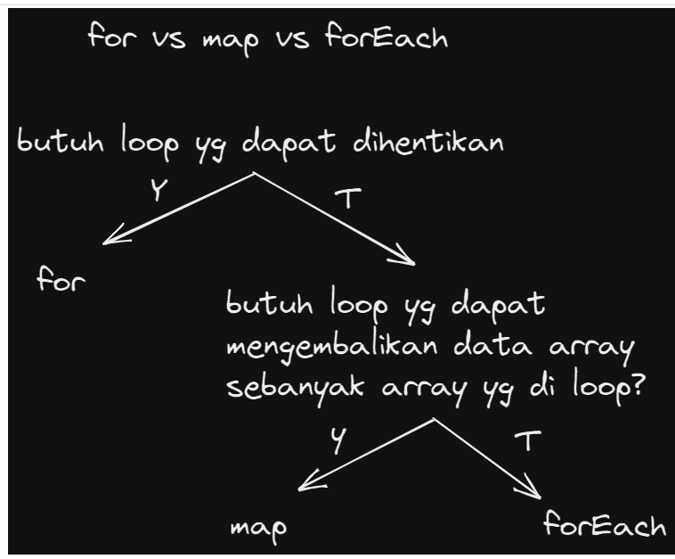

# Writing and Presentation Test Week 2

## **Array dan Multidimensional Array**
- Array adalah tipe data list order yang dapat menyimpan tipe data apapun di dalamnya.
- Array dapat menyimpan tipe data String, Number, Boolean, dan lainnya.
- Contoh Array
    ```javascript
    let random = ["A", 1 , true] // array dapat menyimpan berbagai macam tipe data 
    console.log(hewan) 
    ```
- Membuat array
    - Array didefinisikan menggunakan square brackets []
- Memanggil Array
    - Array pada javascript dihitung dari index data ke-0.
    - Data pertama adalah index ke-0.
    ```javascript
    let random = ["A", 1 , true] // array dapat menyimpan berbagai macam tipe data 

    console.log(hewan)
    // hasil
     0 : "A" // index 0
     1 : 1  // index 1
     2 : true  // index 2
     length : 3 // panjang array

     console.log(hewan[0]) // Output : "A"
     console.log(hewan[2]) // Output : true
    ```
- Update Array
    - Seperti tipe data dan variabel pada umumnya, kita dapat mengupdate data pada Array
    ```javascript
    let random = ["A", 1 , true]
    random[0] = "ABC";

    console.log(random)
    // output : ["ABC", 1 , true]
    ```

- ### Const in Array
    - Jika menggunakan let, kita dapat mengubah array  dengan array baru dan konten nilai yang ada di dalam array dengan nilai lain
    - Const tidak bisa melakukan update data. Namun pada Array kita dapat melakukan update konten nilai di dalam array (mutable).
    - Yang tidak bisa adalah mengubah array dengan array yang baru jika menggunakan const
        ```javascript
        let mobil = ['tesla', 'honda', 'toyota'];
        mobil = ['nissan']
        console.log(mobil) // error

        mobil[2] = ['nissan']
        console.log(mobil) 
        // Output : ['tesla', 'honda', 'nissan'];
        ```
- Array Properties
    - Array memiliki 5 properti yang sering digunakan yaitu constructor, length, index, input, dan prototype.
    - Properties adalah fitur yang sudah disediakan oleh Javascript untuk memudahkan developer.
    - Properties .length
        - length akan mengembalikan nilai dari jumlah panjang data suatu array.
        ```javascript
        let mobil = ['tesla', 'honda', 'toyota'];
        console.log(mobil.lengrh) // Output : 3 
        ```
- Array Method
    - Array memiliki method atau biasa disebut built-in methods.
    - Artinya Javascript sudah memudahkan kita dengan menyediakan function/method umum yang bisa kita gunakan.
    - Kita tidak perlu membuat function lagi jika method yang kita butuhkan sudah tersedia.
    - Contoh Array Built-in Methods
        - .push
            <div align="justify">method untuk menambahkan item  array pada urutan yang paling akhir.

            ```javascript
            let mobil = ['tesla', 'honda', 'toyota'];
            mobil.push('nissan');
            console.log(mobil)
            // Output : ['tesla', 'honda', 'toyota', 'nissan'];
            ```
        - .pop()
            <div align="justify">method yang menghapus item array index terakhir.

            ```javascript
            let mobil = ['tesla', 'honda', 'toyota', 'nissan'];
            mobil.pop()
            console.log(mobil)
            // Output : ['tesla', 'honda', 'toyota'];
            ```
        - .shift()
            <div align="justify"> method untuk menghapus item Array pada index pertama
            
            ```javascript
            let mobil = ['tesla', 'honda', 'toyota', 'nissan'];
            mobil.shift()
            console.log(mobil)
            // Output : ['honda', 'toyota', 'nissan'];
            ```
        - .unshift() 
            <div align="justify">method untuk menambahkan item Array pada index pertama.

            ```javascript
            let mobil = ['honda', 'toyota', 'nissan'];
            mobil.unshift('tesla')
            console.log(mobil)
            // Output : ['tesla', 'honda', 'toyota', 'nissan']
            ```
        - .sort()
            <div align="justify">method untuk mengurutkan secara Ascending atau Descending Alphanumeric
            
            ```javascript
            let angka = [1, 3, 4, 2]
            angka.sort()
            console.log(angka)
            // Output : [1, 2, 3, 4]
            ```
- Looping pada Array
    - Array memiliki built in methods untuk melakukan looping yaitu .map() dan .forEach()
        - .forEach()
            <div align="justify">method untuk melakukan looping pada setiap elemen array.

            ```javascript
            let mobil = ['honda', 'toyota', 'nissan'];
            mobil.forEach(elemnt => {
            console.log(element); 
            // Output : 'honda', 'toyota', 'nissan'
            })
            ```
        - map() 
             <div align="justify">melakukan perulangan/looping dengan membuat array baru.

             ```javascript
             let angka = [1, 3, 4, 2]
             let double = angka.map(num =>{
                return num * 2
             })

             console.log(double)
             // Output : [2, 6, 8, 4]
             ```
    - forEach vs Map
    
        
        
        - Kita bisa lihat bahwa .map() dan forEach() sama-sama melakukan looping dan mengembalikan nilai baru dari operasi yang dilakukan
        - Perbedaannya adalah .forEach tidak dapat membuat Array baru dari hasil operasi yang ada dalam looping
        - Lalu dari segi performance juga sangat jauh.
        - Jadi, gunakan .forEach() jika hanya memerlukan looping untuk menampilkan saja atau menyimpan ke database.
        - Gunakan .map() jika akan melakukan operasi pada array seperti yang dapat mengubah nilai array sebelumnya.

<br>

## **JavaScript Object & Array of Object**
- Jadi pada programming, object adalah sebuah tipe data pada variabel yang menyimpan properti dan fungsi (method)
- Properti adalah data lengkap dari sebuah object.
- Method adalah action dari sebuah object. Apa saja yang dapat dilakukan dari suatu object.
- ### Membuat sebuah object
    - Sama seperti tipe data sebelumnya. Object dapat diassign kedalam sebuah variabel.
    - object person dengan properti
    ```javascript
    let person = {
        name : 'Kiki',
        age : 20,
        isVarified : true
    }
    ```
    - Sama seperti array, didalam object kita dapat menyimpan properti dengan tipe data apapun.
- ### Mengakses Object dan Property Object
    - akses seluruh object
        ```javascript
        let person = {
            name : 'Kiki',
            age : 20,
            isVarified : true
        }
        console.log(person)
        ```
    - Gunakan single quote pada key jika menggunakan spasi seperti ‘current address’
        ```javascript
        let person = {
            name : 'Kiki',
            age : 20,
            ‘current address’ : 'cambridge, UK'
        }
        console.log(person)
        ```
    - Mengakses properti object
        ```javascript
        let person = {
            name : 'Kiki',
            age : 20,
            isVarified : true
        }
        console.log(person.name) // 'Kiki'
        ```

    - Bracket Notation
        <div align="justify">Kita juga bisa menggunakan bracket notation saat memanggil properti dari sebuah object.

        ```javascript
        let person = {
            name : 'Kiki',
            age : 20,
            isVarified : true
        }
        console.log(person['name']) // 'Kiki'
        console.log(person['age']) // 20
        ```
- ### Update Object
    - Kita dapat melakukan update pada variabel dengan tipe data Object.
    - Do’s
        - Object dapat mengupdate value dari key yang sudah tersedia
        - Object dapat menambahkan key dan value baru

    - Update data pada Object
        ```javascript
        let person = {
            name : 'Kiki',
            age : 20,
            isVarified : true
        }
        person.age = 19;
        person,addres = 'Madiun, Dagangan';

        console.log(person)
        /* Output :
        {
            name : 'Kiki',
            age : 19,
            isVarified : true
            addres : 'Madiun, Dagangan'
        } */
        ```

        - Jika menggunakan constant pada variable object. Kita tidak bisa mengganti seluruh data object dengan object yang baru.
            ```javascript
            const person = {
                name : 'Kiki',
                age : 20,
                isVarified : true
            }
            person.age = 19;
            person,addres = 'Madiun, Dagangan';

            console.log(person) // error
            ```
        - Jadi jika membutuhkan untuk update seluruh data object gunakan ‘let’ pada saat deklarasi variabel.

- ### Delete Object Property
    - Kita dapat menghapus properti dari object menggunakan delete operator.
        ```javascript
            const person = {
                name : 'Kiki',
                age : 20,
                isVarified : true
            }
            delete person.age;
            console.log(person) 
            /* Output :
            {
                name : 'Kiki',
                isVarified : true
            }

        ```
- ### Method
    - Jika value yang kita masukkan pada property berupa function.Maka itu disebut Method.
    - Kita bisa membuat method custom untuk kita gunakan pada aplikasi kita.
    - Ada 2 method pada object greeting
        ```javascript
        const greeting = {
            welcome : function () {
                return 'Hallo selamat datang';
            },
            afterTransaction : function () {
                return "terima kasih sudah membeli produk kami";
            },
        };

        console.log(greeting.welcome()); // Hallo selamat datang
        ```

- ### Nested Object
    - Pada real application nanti kalian pasti menemukan data object yang kompleks. Object yang berasal dari turunan object lainnya.
    - Contoh : Data article pada sebuah aplikasi berita
        ```javascript
        const news = {
            title: 'Impact Byte menjadi Unicorn',
            description: 'lorem ipsunm jkkrj kekek kejkje jjejhej ',
            author : {
                people : {
                    name : 'Kiki',
                    age : 20,
                    city : 'Madiun'
                }
            }
        };
        console.log('news:', news.title);
        console.log('Article publised by', news.author.people.news);
        ```
- ### Pass by reference
    - Kita bisa mengubah data yang ada pada object melalui sebuah function dan memasukkan object sebagai parameter function.Ini biasa disebut passed by reference.
    - Kita mengubah data object number dengan sebuah function changeData
        ```javascript
        let number = {
            originA : 2,
            originB : 3
        };

        function changeData (obj) {
            obj.originA = 4;
            obj.originB = 6;
        };

        changeData(number)
        console.log(number.originA); // A
        console.log(number.originB); // B
        ```
- ### Looping Object
    - Jika kita ingin menampilkan seluruh object properti. Kita bisa menggunakan looping.
        ```javascript
        for(let key in object){
            //..
        }
        ```
- ### **Array of Object**
    - Object sama seperti Array yang bisa menyimpan banyak data.
    - Kita dapat menggunakan array of object untuk data yang lebih dari satu.
    - Looping pada Data array of object students

        ```javascript
        let students = [
            {
                name : "kiki",
                age : 20,
                isVarified : true
            },
            {
                name : "amad",
                age : 22,
                isVarified : false
            },
            {
                name : "dika",
                age : 19,
                isVarified : true
            }
        ];

        // gunakan forEach jika object dalam array
        students.forEach((ListStudent) => {
            console.log(ListStudent)
        })
        ```
## **JavaScript Rekursif**
- Recursive adalah function yang memanggil dirinya sendiri sampai kondisi tertentu.
- Recursive kebanyakan digunakan untuk case matematika, fisika, kimia, dan yang berhubungan dengan calculation.
    ```javascript
    function reqursive(){
        // ..
        reqursive();
        // ..
    }
    ```

    ```javascript
    function reqursive(){
        if (conditional){
            //..
        }else{
            reqursive();
        }
    };
    ```
- A New Paradigm:
    - procedural
    - conditional
    - looping
    - modular (function)
    - recursive

- Ciri dari rekursif:
    - Fungsi rekursif selalu memiliki kondisi yang menyatakan kapan fungsi tersebut berhenti. Kondisi ini harus dapat dibuktikan akan tercapai, karena jika tidak tercapai maka kita tidak dapat membuktikan bahwa fungsi akan berhenti, yang berarti algoritma kita tidak benar.
    - Fungsi rekursif selalu memanggil dirinya sendiri sambil mengurangi atau memecahkan data masukan setiap panggilannya. Hal ini penting diingat, karena tujuan utama dari rekursif ialah memecahkan masalah dengan mengurangi masalah tersebut menjadi masalah-masalah kecil.

- Contoh kasus rekursif
    - Fungsi rekursif menghitung mundur number
        ```javascript
        function countDown(fromNumber) {
            console.log(fromNumber)
            let nextNumber = fromNumber - 1;

            if (nextNumber > 0) {
            countDown(nextNumber);
            }
        }
        countDown(3);
        /* Output : 
        3
        2
        1 */
        ```

## **JavaScript Modules**
- Js Modules adalah cara untuk memisahkan kode file yang berbeda
- Keuntungan menggunakan modules : 
    - mudah untuk mengelola file
    - kode tidak menumpuk pada satu file

- Membuat Js Modules :
    - tambahkan type= "module" pada script utama
        ```javascript
        <script src="indonesia.js" type="module"></script>
        ```
    - siapkan script ke-2 dan seterusnya untuk melakukan export
    - lakukan import pada file/script utama

- contoh Export Import js module
    - script Amerika.js
        ```javascript
        let apple = ["iphone", "macbook", "imac"]
        export {apple}
        ```
    - script jepang.js
        ```javascript
        import {apple} from './amerika.js';
        console.log(apple);

        let motor = ["suzuki", "yamaha", "honda", "kawasaki"]
        const smartPhone = ["sony", "samsung", "fujitsu", "LG"]

        let dokumenNegara = "Hello"

        export function sayHello() {
        console.log("hallooo")
        }
        let entertainment = ["anime", "manga", "wibu", "dorama"]

        // kita dapat melakukan export pada variabel, function, class
        // "export" dapat melakukan banyak export
        // "export" di tangkap (import) menggunakan kurung kurawal
        // "export default" cuma bisa 1 aja yg di export
        // "export default" ditangkap tanpa kurung kurawal
        export { motor, smartPhone as smartPhoneJepang}
        export default entertainment
        ```
    - script indonesia.js
        ```javascript
        // import dari file jepang dan amerika
        import Entertainment, { motor as motorJepang, smartPhoneJepang, sayHello } from "./jepang.js"
        import {apple} from './amerika.js';

        sayHello()

        console.log(Entertainment);
        console.log(smartPhoneJepang);

        console.log(motorJepang);

        motorJepang.splice(1, 1)

        console.log(motorJepang)
        console.log(apple);
        ```
        <br>

## **JavaScript Asynchronous**

### **Introduction**
- Penjelasan 
    <div align="justify">Javascript adalah bahasa pemrograman single-thread yang artinya hanya dapat mengeksekusi satu task pada satu waktu atau biasa disebut synchronous.
- Pada konsep pemrograman (web development pada case kita) dikenal istilah Asynchronous.
- Asynchronous mengizinkan komputer memproses task yang lain sambil menunggu proses yang masih berlangsung.
- Kita bisa membuat asynchronous secara simulasi artinya tidak murni asynchronous dengan beberapa cara:
    - Callback
    - Promises
    - Async/Await

### **Callback**
- Callback function adalah function yang kita letakan di dalam argumen/parameter pada function, dan function tersebut akan dieksekusi setelah function pertama menyelesaikan tugasnya.
    ```javascript
    const mainFunc = (number1, number2, callBack) => {
        console.log(number1 + number2)
        callBack()
    }

    const myCallback = () => {
        console.log('Done !')
    }
    main(1,2,myCallback) // Output : 3 Done !
    ```
- Proses asynchronous identik dengan delay, dimana hasil dari proses tersebut membutuhkan selang waktu tertentu untuk menghasilkan output. 

- synchronous atau lawan dari asynchronous
    <div align="justify">yaitu program dijalankan sesuai urutan code
    
    ```javascript
    function p1(){
            console.log('p1 berhasil di jalankan')
    }
    function p2(){
        console.log('p2 berhasil di jalankan')
    }
    function p3(){
        console.log('p3 berhasil di jalankan')
    }
    p1();
    p2();
    p3();
    /* Output : 
    p1 berhasil di jalankan
    p1 berhasil di jalankan
    p1 berhasil di jalankan */
    ```
- Pada asynchronous kita menggunakan setTimeOut untuk simulasinya. Proses function pada p2 kita lewati sambil menunggu selesai, program lanjut ke function p3
    ```javascript
    const p1() => {
            console.log('p1 telah selesai di jalankan')
    }
    function p2() =>{
        setTimeout(() => {
        console.log('p2 berhasil di jalankan')
        }, 3000)
    };
    const p3() =>{
        p1();
        p2();
        console.log('p3 berhasil di jalankan')
    }
    p3();
    ```
    - setTimeout digunakan untuk simulasi asynchronous. Karena sebenarnya kita tidak bisa membuat proses asynchronous murni.

### **Promises** 
- Promise adalah salah satu fitur baru di ES6, biasa digunakan untuk melakukan http request/fetch data dari API.
- Dalam pengambilan data, promise memiliki 3 kemungkinan state.
    - Pending(sedang dalam proses)
    - Fulfilled (berhasil)
    - Rejected (gagal)
    ```javascript
    console.log("PROMISES")
    // pembuatan promise.............
    let nontonPromise = new Promise((resolve, reject) => {
    if (true) {
        resolve("nonton terpenuhi") // berhasil
    } 

    reject("gagal"); // gagal
    });

    // eksekusi proses..............
    console.log("A");

    nontonPromise
    .then((result) => {
        console.log(result);
        return `${result} bareng doi`
    })
    .then((result) => {
        console.log(result)
    })
    .catch((err) => {
        console.log(err);
    });

    console.log("C");
    ```

### **Async-Await**
- Async - await adalah salah satu fitur baru dari javascript yang digunakan untuk menangani hasil dari sebuah Promise.
- Sedangkan await berfungsi untuk menunda sebuah kode dijalankan sampai proses asynchronous berhasil.
- Cara penulisan Async/await menggunakan es6 dan tidak menggunakan es6.
    ```javascript
    async function hello(){
        let result = await 'Hello'
        return result
    }
    // es 6
    const hello1 = async () => {
        let result = await 'hello'
        return result
    }
    ```

### **HTTP Request fetch()**
- Fetch adalah native web API untuk melakukan HTTP calls dari external network.
- fetch() memiliki parameter utama yaitu URL/endpoint API, dan parameter kedua yaitu options, options ini berisi method, headers dan body. Tergantung keinginan kita.

<br>

## **JavaScript Web Storage**
- Ada beberapa cara untuk menyimpan data pengguna seperti pencarian, artikel berita, dan lain-lain ke lokal (browser) menggunakan web storage seperti cookies, local storage, dan session storage. 

### Cookies
- Cookies adalah data kecil yang dikirim dari situs web dan disimpan di komputer kita oleh web browser saat kita menjelajah. Disebut data kecil karena maksimum data yang dapat disimpan dalam cookies adalah 4096 bytes (4 KB).
- Biasanya data yang disimpan di cookies adalah access token pengguna saat login atau data pencarian saat melakukan pencarian pada situs web tertentu.

### **Local Storage**
- Dengan memanfaatkan local storage dan session storage, kita dapat menyimpan data lebih besar yaitu 5MB per page tanpa mempengaruhi kinerja situs web.
- Namun, penting untuk diketahui agar kita tidak menyimpan data sensitif seperti password ke dalam local storage ataupun session storage untuk menghindari serangan pencurian data.
- Pernahkah kita saat melakukan pencarian pada sebuah situs lalu situs tersebut menampilkan riwayat pencarian kita? Iya, data pencarian tersebut disimpan ke dalam local storage untuk diolah menjadi riwayat pencarian.
- Local storage memiliki karakteristik sebagai berikut:
    - Menyimpan data tanpa tanggal kadaluarsa.
    - Data tidak akan dihapus ketika web browser ditutup dan akan tersedia seterusnya selama kita tidak menghapus data local storage pada web browser.
    - Dapat menyimpan data hingga 5MB.
    - Hanya dapat menyimpan data string.

- Untuk menyimpan data pada local storage, kita menggunakan method setItem() yang membutuhkan 2 parameter. Parameter pertama adalah key yang ingin kita simpan dan parameter kedua adalah data (value) dari key yang akan disimpan.
    ```javascript
    localStorage.setItem('key', value);
    ```
- Untuk mengambil data yang telah tersimpan pada local storage, kita dapat menggunakan method getItem() yang membutuhkan 1 parameter. Parameter tersebut adalah key dari data yang kita inginkan.
    ```javascript
    localStorage.getItem('key');
    ```

- Untuk menghapus data yang telah tersimpan pada local storage, kita dapat menggunakan method removeItem() yang membutuhkan 1 parameter. Parameter tersebut adalah key dari data yang ingin kita hapus.
    ```javascript
    // menghapus key tertentu
    localStorage.removeItem("key");

    // menghapus semua key
    localStorage.clear();
    ```
### **Session Storage**
- Berbeda dengan local storage, walaupun masuk ke dalam web storage, data yang tersimpan pada session storage akan hilang ketika session dari sebuah laman berakhir.
- Session storage mempunyai beberapa karakteristik, yaitu:
    - Data yang disimpan pada session storage akan terus tersimpan selama browser terbuka dan tidak hilang jika laman di-reload.
    - Membuka banyak tab/window dengan URL yang sama, akan menciptakan session storage yang berbeda di masing-masing tab/window.
    - Menutup tab/window akan mengakhiri session dan menghapus data yang tersimpan di session storage pada tab/window tersebut.
    - Data yang tersimpan dalam session storage harus berbentuk string.
    - Hanya dapat menyimpan data sebanyak 5MB.

- sintaks untuk menyimpan data pada session storage adalah sebagai berikut:
    ```javascript
    // menambah session storage
    sessionStorage.setItem('key', value);
    ```
- cara mendapatkan data dari session storage juga menggunakan getItem(), seperti berikut ini:
    ```javascript
    // mendapatkan session storage
    sessionStorage.getItem('key');
    ```
- Syntax untuk menghapus data dari session storage ada 2, yaitu:
    ```javascript
    // menghapus session storage satu persatu berdasarkan key
    sessionStorage.removeItem('key');

    // menghapus seluruh session storage sekaligus
    sessionStorage.clear();
    ```


