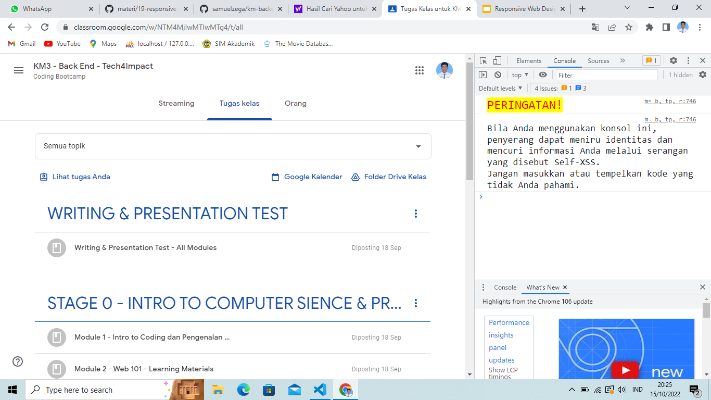

# Writing and Presentation Test Week 4
## JavaScript Asynchronous - Fetch
- Fetch adalah native web API untuk melakukan HTTP calls dari external network.
- fetch() memiliki parameter utama yaitu URL/endpoint API, dan parameter kedua yaitu options, options ini berisi method, headers dan body. Tergantung keinginan kita.
    ```javascript
    const URL = "https://api.themoviedb.org/3/movie/popular?api_key=d41688cb0f0ee69b62145a634b120198&language=en-US"
    const Options = {
        method : "GET"/"POST",
        headers : {
            "Content-type" : "Aplication/json"
        },
        body : user
    }
    fetch(URL, Options)
    ```
- Contoh function untuk mengambil data dari API menggunakan fetch(), Promise based.
    ```javascript
    const getDataAPI = () => {
        const URL_API = "https://api.themoviedb.org/3/movie/popular?api_key=d41688cb0f0ee69b62145a634b120198&language=en-US"
        const Options = {
            method : "GET"
        }
        fetch (URL_API, Options)
    .then((respons => respons.json))
    .then(results => console.log(results))
    .catch((err => console.log("ERROR")))
    }
    ```
- Contoh function untuk mengambil data dari API menggunakan fetch(), Dengan Async Await..
    ```javascript
    const getDataAPIAsnc = async () => {
        const URL_API = "https://api.themoviedb.org/3/movie/popular?api_key=d41688cb0f0ee69b62145a634b120198&language=en-US"
        const Options = {
            method : "GET"
        }
        let respons = await fetch(URL_API, Options)
        respons = await respons.json()
        console.log(respons);
    }
    getDataAPIAsnc()
    ```

## JavaScript Asynchronous - Async Await
- Async - await adalah salah satu fitur baru dari javascript yang digunakan untuk menangani hasil dari sebuah Promise.
- Sedangkan await berfungsi untuk menunda sebuah kode dijalankan sampai proses asynchronous berhasil.
- Cara penulisan Async/await menggunakan es6 dan tidak menggunakan es6.
    ```javascript
    async function hallo() {
        let results = await "Helloooo"
        return results
    }
    // es6
    const hello = async () => {
        let results = await "Helloooo"
        ret
    ```

## **Git dan GitHub Lanjutan** 
- GIT BRANCH
    - Fitur yang WAJIB digunakan jika berkolaborasi dengan developer atau dalam tim
    - Untuk menghindari conflict code yang dikembangkan. Kita tidak boleh berkolaborasi dalam project di satu branch yang sama!
    - Contoh Masalah :
        <div align="justify">Misalnya Bowo akan mengerjakan fitur A dan Gigih mengerjakan fitur B. Masing-masing fitur harus dibuat branch masing-masing.
        - Tidak boleh mengganggu branch ‘master’ yang sudah terupdate
    - Membuat Branc Baru
        ```
        git branch <branch>
        ```
    - Misalkan kita ingin membuat fitur register. Jadi kita akan membuat branch baru.
        ```
        git branch fitur_register
        ```
    - Melihat list Branch
        ```
        proyek-01 git:(1e91872) git branch
        ```
    - Pindah ke branch tertentu
        ```
        git checkout fitur_register
        ```
    - Delete Branch 
        ```
        git branch -d halaman_login
        ```

- GIT MERGE
    - Setelah membuat branch baru, lalu lakukan commit.Saatnya kita menyatukan pekerjaan ke master file/branch utama yaitu branch MASTER
    - Untuk menyatukan branch cabang fitur yang telah kita kembangkan. Gunakan perintah seperti berikut ini:
        - Kita harus checkout dahulu ke branch master
            ```
            git checkout master
            ```
        - Lalu lakukan marge
            ```
            git merge halaman_login
            ```


## **Responsive Web Design**
- Responsive Web Design adalah bertujuan membuat desain website kita dapat di akses dalam device apapun
- Device yang umum di gunakan adalah laptop/PC, Smartphone, dan tablet./
 ### Setting up Chrome Dev Tols
 - Setiap developer website wajib m\memudahkan proses development web.
 - Pada browser chrome biasa disebut dengan Chrome Dev Tools.
 - Akses Chrome Dev Tools
    - Jika sudah membuka browser Chrome, kita bisa menggunakan shortcut ini:
        ```
        ctrl + shift + j
        ```
    - Tampilan Chrome Dev Tools
    
- Tools Responsive Web Design
    - Klik icon yang mengilustrasikan phone dan tablet

### Add Viewport in HTML
- Meta Viewport required on mobile responsive
    ```javascript
    <meta name="viewport" content="width=device-width, initial-scale=1.0">
    ```
- HTML with Meta Viewport
    ```html
    <!DOCTYPE html> 
    <html lang="en">
    <head>
        <meta charset="UTF-8">
        <meta name="viewport" content="width=device-width, initial-scale=1.0"> <title>Responsive Web Design</title>
    </head> 
    <body>

    </body>
    </html>
    ```
### Use Max-width element
- Properti max-width digunakan untuk mengatur lebar maksimum elemen.
- Hal ini mencegah nilai properti lebar dari menjadi lebih besar dari max-lebar.
- Add styling max-width
    ```html
    <!DOCTYPE html>
    <html lang="en">
    <head>
        <meta charset="UTF-8"> <meta name="viewport" content="width=device-width, initial-scale=1.0"> <title>Responsive Web Design</title>
    </head>
    <body>
        </-- Add styles max-width 100% pada attribut element img -->
        
    </body>
    </html>
    ```
### Media Query
- RWD sangat menyenangkan dan mudah jika kita menggunakan media query.
- Jenis media query
    - Media query untuk responsive web design umumnya hanya menggunakan 2 jenis media query.
    - Keduanya yaitu min-width dan max-width
- Setting up media query
    ```css
    @media screen and (min-width: your pixel){
        /* tag html and css  */
    }
    @media screen and (max-width: your pixel) {
        /* tag html and css  */
    }
    ```
- Media query digunakan untuk membuat beberapa styles tergantung pada jenis device.
- Ada 2 cara/pattern dalam menggunakan media query :
    - Cara ke-1: Membuat file css berbeda untuk masing-masing device
        <div align="justify">Ada 2 file CSS yaitu main.css dan main.mobile.css
        
        ```html
        <link rel="stylesheet" href="styles/main.css">

        <link rel="stylesheet" media="screen and (max-width: 500px)" href="styles/main.mobile.css">
        ```
        - Css untuk file main.css
            ```css
            body {
            background-color: white;
            }
            ```
        - Css untuk file main.mobail.css
            ```css
            body {
            background-color: aquamarine;
            }
            ```
    - Cara ke-2: Kita menggabungkan 1 file CSS untuk setting styling berbagai device
        - index.html
            ```html
            <!DOCTYPE html>
            <html lang="en">
            <head>
                <meta charset="UTF-8"> 
                <meta name="viewport" content="width=device-width initial-scale=1.0"> 
                <title>Responsive Web Design</title>

                <link rel="stylesheet" href="styles/main.css">
            </head>
            <body>
                <h2>Responsive Web Design (RWD)</h2>
            </body>
            </html>
            ```
        - style.css
            ```css
            body {
                background-color: white;
            }

            @media screen and (max-width: 500px) {
                body {
                    background-color: aquamarine;
                }
            }
            ```

### Breakpoint
- Perubahan yg terjadi pada tampilan saat berganti device atau ukuran width disebut breakpoint.
- Ada 3 breakpoint yakni 
    - pada laptop
    - pada ipad/tablet
    - pada mobile phone

<br>

### Complex Breakpoint Media Query
- Jika kita menginginkan tampilan yang ingin diterapkan pada range ukuran device tertentu, kita bisa membuatnya menjadi range media query.
- Menggunakan range media query min dan max
    ```css
    body {
    background-color: white;
    }

    @media screen and (min-width: 500px) and (max-width: 700px) {
         body {
            background-color: aquamarine;
            }
    }
    ```
### Important Notes
- Tidak ada aturan baku besaran width dan berapa banyak breakpoint yang harus dilakukan.
- Responsive web design dilakukan sesuai kebutuhan konten kita. Jika konten yang ditampilkan sudah tidak bisa diakses atau sulit dilihat pada width tertentu, sudah saatnya kamu menggunakan media query.

<br>

## **Bootstrap 5**
- Pengertian Bootstrap
    <div align="justify">Bootstrap adalah sebuah framework yang paling populer digunakan untuk membuat sebuah website. Bootstrap membuat front-end developer dapat membuat website dengan cepat, fokus pada responsive mobile, dan membuat website menjadi lebih interaktif tanpa membuat banyak CSS dan JavaScript dari nol.
    
- Fungsi Bootstrap
    <div align="justify">Tujuan dan fungsi Bootstrap adalah untuk membuat website responsive dan mobile-first. Jadi, semua elemen antarmuka website dipastikan bisa bekerja secara optimal di semua ukuran layar, baik desktop maupun perangkat seluler.

- Kelebihan dari bootstrap 5
    - Mudah di gunakan
    - Responsive Grid
    - Kompatibel dengan banyak Browser
    - Bootstrap Image System
    - DOkumentasi Bootstrap yang lengkap

- 3 file utama Bootsstrap 5
    - Bootstrap.css
    - Bootstrap.js
    - Glyphicons

- Cara Mengguanakn Bootstrap Offline
    1. Siapkan Project webite
    2. Donwload bootstrap 5 di <a href="https://getbootstrap.com/docs/5.1/getting-started/download/">di_sini</a>
    3. Ekstrak file bootstrap
    4. Import Boostrap 5 ke file HTML
        ```html
        <!DOCTYPE html>
        <html lang="en">
        <head>
            <meta charset="UTF-8">
            <meta http-equiv="X-UA-Compatible" content="IE=edge">
            <meta name="viewport" content="width=device-width, initial-scale=1.0">
            <title>Kiki Films</title>
            
            <link rel="stylesheet" href="css/bootstrap.min.css"> <!--dari bootsrap -->
            <script src="js/bootstrap.bundle.min.js"></script> <!--dari bootsrap -->
            <script type="js/bootstrap.min.js"></script>
            <!--dari bootsrap -->
        </head>
        <body>
            
        </body>
        </html>
        ```
- Contoh penggunaan bootstrap
    - Membuat navbar
    ```html
    <body>
        <section>
            <nav class="navbar bg-light">
                <div class="container-fluid">
                <a class="navbar-brand">Kiki Films</a>
                <form class="d-flex" role="search" id="form">
                    <input id="search" class="form-control me-2" type="search" placeholder="Search" aria-label="Search">
                    <button class="btn btn-outline-success" type="submit" id="search">Search</button>
                </form>
                </div>
            </nav>
        </section>
    </body>
    ```
    