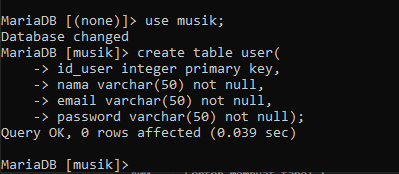

# **Writing and Presentation Test Week 5**

## **Web Server & RESTFUL API**
### **WEB SERVER**
- Web Server adalah suatu perangkat lunak (software) dalam server yang berfungsi untuk menerima permintaan (request) dari client atau browser berupa halaman website melalui protokol HTTP/ HTTPS, lalu merespon permintaan tersebut dalam bentuk halaman website berupa dokumen HTML atau PHP.
- Web server terdiri dari 2 komponen penting:
    - Hardware
    - Software

- Di sisi Hardware, web server adalah komputer yang menyimpan software server web dan file komponen situs web. (misalnya, dokumen HTML, gambar, CSS stylesheet, dan file JavaScript) Server web terhubung ke Internet dan mendukung pertukaran data fisik dengan perangkat lain yang terhubung ke web.
- Di sisi software, web server berfungsi mencakup beberapa bagian yang mengontrol bagaimana pengguna web mengakses file yang dihosting.
- Server HTTP adalah perangkat lunak yang memahami URL (alamat web) dan HTTP (protokol yang digunakan browser Anda untuk melihat halaman web).

### **Static Web Server VS Dynamic Web Server**
- **Static Web Server**
    <div align="justify">Static Web Server, atau stack, terdiri dari komputer (perangkat keras) dengan server HTTP (perangkat lunak). disebut "static" karena server mengirimkan file yang dihosting apa adanya ke browser.

    <br>
- **Dynamic Web Server**
    <div align="justify">Dynamic Web Server terdiri dari server web static ditambah perangkat lunak tambahan, paling sering server aplikasi dan database. disebut "dynamic" karena server aplikasi memperbarui file yang dihosting sebelum mengirim konten ke browser Anda melalui server HTTP

### **Server Side Programming**
- Server web menunggu pesan permintaan klien, memprosesnya saat tiba, dan membalas browser web dengan pesan respons HTTP. Respons berisi baris status yang menunjukkan apakah permintaan berhasil atau tidak (mis. "HTTP/1.1 200 OK" untuk berhasil).

    <div align="justify">Isi respons yang berhasil atas permintaan akan berisi sumber daya yang diminta (misalnya halaman HTML baru, atau gambar, dll...), yang kemudian dapat ditampilkan oleh browser web.

- Static Sites
    <div align="justify">Menunjukkan arsitektur web server dasar untuk situs static (situs static adalah situs yang mengembalikan konten hard-coded yang sama dari server setiap kali sumber daya tertentu diminta).
- Dynamic Site
    <div align="justify">Dynamic Website adalah situs di mana beberapa konten respons dihasilkan secara dinamis, hanya bila diperlukan.

### **Perbedaan Static Sites dan Dynamic Site**
- Mereka memiliki tujuan dan perhatian yang berbeda.
- Mereka umumnya tidak menggunakan bahasa pemrograman yang sama (pengecualiannya adalah JavaScript, yang dapat digunakan di sisi server dan klien).
- Mereka berjalan di dalam lingkungan sistem operasi yang berbeda.

### **yang dapat Anda lakukan di server-side**
- Efficient storage and delivery of information
- Customised user experience
- Controlled access to content
- Store session/state information
- Notifications and communication
- Data analysis

### **REST**
- REST, atau Representational State Transfer, adalah gaya arsitektur untuk menyediakan standar antara sistem komputer di web, sehingga memudahkan sistem untuk berkomunikasi satu sama lain.
- Sistem yang sesuai dengan REST, sering disebut sistem RESTful, dicirikan oleh bagaimana mereka tidak memiliki kewarganegaraan dan memisahkan masalah klien dan server
- Dalam gaya arsitektur REST, implementasi klien dan implementasi server dapat dilakukan secara independen tanpa saling mengetahui satu sama lain.
- sisi klien dapat diubah setiap saat tanpa mempengaruhi operasi server, dan kode di sisi server dapat diubah tanpa mempengaruhi operasi klien.
- Dengan menggunakan antarmuka REST, klien yang berbeda mencapai titik akhir REST yang sama

### **Komunikasi antara Klien dan Server**
- **Membuat permintaan**
    <div align="justify">REST mengharuskan klien membuat permintaan ke server untuk mengambil atau mengubah data di server. Permintaan umumnya terdiri dari:

    - kata kerja HTTP, yang mendefinisikan jenis operasi apa yang harus dilakukan
    - header, yang memungkinkan klien untuk menyampaikan informasi tentang permintaan
    - jalan menuju sumber daya
    - badan pesan opsional yang berisi data
- **HTTP VERBS**
    <div align="justify">Ada 4 kata kerja HTTP dasar yang kami gunakan dalam permintaan :

    - GET — mengambil sumber daya tertentu (berdasarkan id) atau kumpulan sumber daya
    - POST — buat sumber daya baru
    - PUT — perbarui sumber daya tertentu (berdasarkan id)
    - DELETE — menghapus sumber daya tertentu dengan id

### **Headers and Accept Parameters**
- Di header permintaan, klien mengirimkan jenis konten yang dapat diterimanya dari server.
- Ini disebut bidang Terima, dan ini memastikan bahwa server tidak mengirim data yang tidak dapat dipahami atau diproses oleh klien. Opsi untuk tipe konten adalah Tipe MIME.
- Tipe lain dan subtipe yang umum digunakan:
    - gambar — gambar/png, gambar/jpeg, gambar/gif
    - audio — audio/wav, audio/mpeg
    - video — video/mp4, video/ogg
    - aplikasi — aplikasi/json, aplikasi/pdf, aplikasi/xml, aplikasi/octet-stream

### **Paths**
- Permintaan harus berisi jalur ke sumber daya tempat operasi harus dilakukan. Dalam RESTful API, jalur harus dirancang untuk membantu klien mengetahui apa yang sedang terjadi.
### **Sending Responses**
- Content Types
    <div align="justify">Misalnya, ketika klien mengakses sumber daya dengan id 23 di sumber artikel dengan Permintaan GET ini:

    DAPATKAN /artikel/23 HTTP/1.1
    Terima: teks/html, aplikasi/xhtml

    Server mungkin mengirim kembali konten dengan header respons:

    HTTP/1.1 200 (Oke)
    Tipe-Konten: teks/html
- Response Codes
    <div align="justify">Tanggapan dari server berisi kode status untuk memperingatkan klien tentang informasi tentang keberhasilan operasi.

    <div align="justify">Untuk setiap kata kerja HTTP, ada kode status yang diharapkan yang harus dikembalikan server setelah berhasil:

    - GET — kembalikan 200 (OK)
    - POST — kembalikan 201 (DIBUAT)
    - PUT — kembalikan 200 (OK)
    - DELETE — return 204 (NO CONTENT) Jika operasi gagal, kembalikan kode status paling spesifik yang mungkin terkait dengan masalah yang ditemui.

<hr>

## **Intro & Essential Node.js**
- Node.js adalah software open-source yang bisa digunakan untuk membuat aplikasi jaringan dan aplikasi server-side yang real-time dan scalable (bisa dikembangkan sesuai kebutuhan). Pada dasarnya, Node.js adalah runtime environment lintas platform single-thread yang dibangun berdasarkan engine JavaScript V8 Chrome.
- Node JS memiliki konsep yang berbeda dengan javascript yang kita kenal.

### **Node JS Architecture**
- **Single Thread**
    <div align="justify">Javascript menggunakan konsep single thread, yang berarti hanya memiliki satu tumpukan panggilan yang digunakan untuk menjalankan program.
    <div align="justify">Javascript menggunakan call stack untuk melakukan manajemen single thread. Ketika terdapat perintah baru maka akan ditambahkan (push) dan akan di keluarkan ketika perintahnya sudah selasai (pop).
- **Even Loop**
    - Terdapat event queue yang berguna sebagai penampung ketika terdapat perintah baru yang akan dieksekusi.
    - vent loop akan memfasilitasi kondisi ini, event loop akan memeriksa terus menerus, ketika antrian kosong di call stack maka akan menambah antrian baru dari event queue sampai semua perintah selesai di eksekusi.
- **Server side scripting**
    <div align="justify">Dengan menggunakan NodeJS kita dapat menjalankan javascript di server side menggunakan terminal command line menggunakan perintah “node”. 

### **Javascript For Node JS**
- bahasa pemorgraman javascript agar mempermudah memahami Node JS  yaitu :
    - Arrow function expression
        <div align="justify">merupakan fitur terbaru dari javascript, yaitu mempermudah membuat sintaks function menggunakan “=>”
    - Asynchronous
        <div align="justify">mengeksekusi code tanpa berurutan dengan cara “skip” code dan melanjutkan eksekusi code selanjutnya.
    - JSON
        <div align="justify">Merupakan format yang digunakan untuk menyimpan dan mengirim data menggunakan konsep object di javascript.

### **Instalasi Node JS**
- Download software dari link : https://nodejs.org/en/ Jalankan dan Install Node JS
- Untuk mengetes apakah berhasil terinstall, dapat menjalankan
    ```javascript
    node -v // mengecek versi NodeJS 

    npm -v // mengecek npm
    ```
    NodeJS ini juga dilengkapi dengan NPM

### **Running Node JS **
- Kita dapat menggunakan node di terminal kita dengan mengetik “node” kemudian bisa membuat code javascript dan langsung dieksekusi

## **Node JS for Back end Development**
### **Build In Module Node JS**
- **Console**
    <div align="justify">Console merupakan module bawaan dari javascript yang ada di node JS untuk digunakan sebagai debug atau menampilkan code secara interface.

    ```javascript
    console.log("this is a console module from javascript")
    ```
-  **Process**
    <div align="justify">Process adalah modules yang digunakan untuk menampilkan dan mengontrol prosess Node JS yang sedang dijalankan.

    ```javascript
    conts process = require('process')
    const env = process.env
    ```
- **OS**
    <div align="justify">OS module merupakan module yang digunakan untuk menyediakan informasi terkait sistem operasi komputer yang digunakan user.

    ```javascript
    var os = require('os')
    ```
- **Util**
    <div align="justify">Module Util merupakan alat bantu / utilities untuk mendukung kebutuhan internal API di Node JS.

    ```javascript
    const util = require('util');
    const debuglog = util.debuglog('foo')
    ```
- **Events**
    ```javascript
    const events = require('events');
    ```
- **Errors**
    <div align="justify">Merupakan modules yang dapat digunakan untuk mendefinisikan error di Node JS sehingga lebih informatif.

    ```javascript
    try {
        const m = 1;
        const n = m + 2;
    }catch(err){

    }
    ```
- **Buffer**
    <div align="justify">Merupakan modules yang digunakan untuk mengakses, mengelola dan mengubah tipe data raw atau tipe data bytes.

    ```javascript
    import {'Buffer'} from 'buffer';
    ```

- **FS**
    <div align="justify">Fs atau “file system” merupakan module yang dapat membantu berinteraksi dengan file yang ada diluar code. FS paling sering digunakan untuk membaca file dengan ekstensi .txt, .csv, dan .json.

    ```javascript
     import {'readFileSync'} from 'fs';
    ```
- **Timers**
     <div align="justify">merupakan modules yang digunakan untuk melakukan scheduling atau mengatur waktu pemanggilan fungsi yang dapat diatur di waktu tertentu.

     ```javascript
     import {
        seatTimeout
     } from 'timers/promises';
    ```
<br>

### **Membuat Web Server Dengan Node JS**
- **Node JS Web Server**
    <div align="justify">Node.js memiliki built-in modul yang disebut HTTP, built-in modul ini memungkinkan Node JS mentransfer data melalui Hyper Text Transfer Protocol (HTTP).

    - Untuk menggunakan modul HTTP, gunakan require()
    - Gunakan method createServer() untuk membuat server HTTP
    - Callback function yang digunakan pada method http.createServer(), akan dijalankan ketika seseorang mencoba mengakses komputer pada port 8080.

- **Menambahkan HTTP Header**
    - Kita bisa menggunakan method res.writeHead() untuk menambahkan header HTTP.
    - Argumen pertama dari method res.writeHead() adalah status code, 200 berarti semuanya OK.
    - Argumen kedua adalah objek yang berisi header respons.
    - espons yang dikembalikan dari HTTP web server bisa dalam berbagai format
    - Contohnya, Kita bisa mengembalikan response dalam format JSON dan HTML, namun kita juga dapat mengembalikan format teks lain seperti XML dan CSV.
    - Selain itu web server dapat mengembalikan data non-teks seperti PDF, file zip, audio, dan video.
    - Format ini harus ditambahkan kedalam HTTP Header.

- **Membaca Query String**
    - Callback function pada method http.createServer() memiliki argumen req yang mewakili request dari klien, sebagai objek (objek http.IncomingMessage).
    - Objek ini memiliki sebuah properti yang disebut "url" yang menyimpan informasi url yang sedang mengakses.

- **Split Query String**
    - Ada build-in module yang bisa kita gunakan untuk split query string menjadi beberapa bagian yang dapat dibaca.
    - Build-in modulenya adalah URL Module.

<hr>

## **Express JS**
Express.js, atau singkatnya Express, adalah salah satu framework yang berasal dari bahasa pemrograman JavaScript yang dirancang secara fleksibel dan minimalis, untuk pengembangan aplikasi back-end.

- ### **Back End Web Application**
    Back end app adalah aplikasi yang berjalan di server-side yang bekerja untuk memberikan informasi berupa data sesuai request dari client / browser / front end app.

- ### **REST API**
    RESTful API / REST API merupakan penerapan dari API (Application Programming Interface). 

    REST (Representional State Transfer) adalah sebuah arsitektur metode komunikasi yang menggunakan protokol HTTP untuk pertukaran data dimana metode ini sering diterapkan dalam pengembangan aplikasi.

    - RESTFUL API memiliki 4 komponen penting yaitu:
        - URL Design
        - HTTP Verbs
        - HTTP Response Code
        - Format Response

- **Install express JS**
    <div align="justify">Kita bisa menggunakan NPM untuk menginstall express JS.

    ```
    npm install express --save
    ```
- **Preparation**
    <div align="justify">Beberapa module yang perlu diinstal untuk mempermudah develop server side application, seperti nodemon (agar dapat restart application otomatis selama proses development).

    ```
    npm install --save-dev nodemon
    ```
    ```javascript
    const express = require('express') 
    const app = express()
    const port = 3000

    app.get('/', (req, res) => { 
        res.send('Hello World!')
    }
    app.listen(port, () => {
    console.log(`Example app listening at http://localhost:${port}`)
    })
    ```

- ### **Basic Routes**
    Routes adalah sebuah end point yang diapat kita akses menggunakan URL di website.

- ### **method**
    Kita dapat menggunakan method yang dalam REST API seperti POST, PUT, PATCH dan DELETE

    ```javascript
    app.Post('/posting', (req,res) =>{
        res.send("posting succes!!!")
    })

    app.Delete('/posting', (req,res) =>{
        res.send("deleting succes!!!")
    })
    ```

- ### **Response**
    Di dalam route kita dapat mengirim response menggunakan parameter dari route express.js yaitu “res.Send()” untuk mengirim plain text ketika kita mengakses route tersebut.

    Kita dapat mengirim response berupa output json yang biasa dipakai untuk back end application.

- ### **Status Code**
    Kita sangat perlu memberikan status code sebagai informasi apakah route yang kita akses berjalan sebagaimana mestinya dan tidak terjadi error.

- ### **Query**
    Parameter yang digunakan untuk membantu menentukan tindakan yang lebih spesifik daripada hanya sekedar router biasa.

    Di ExpressJS kita juga dapat membaca query menggunakan req.query, 

- ### **Nested route**
    Nested route digunakan ketika terdapat banyak route yang memiliki nama yang sama atau ingin membuat route yang lebih mendalam

### **Express Middleware**
- Middleware function adalah sebuah fungsi yang memiliki akses ke object request (req), object response (res), dan sebuah fungsi next didalam request-response cycle.
- Fungsi next biasanya di berikan nama variable next.
- **Cara Middleware Bekerja**
    - Jika pada tahap mana pun middleware function menentukan bahwa suatu HTTP Request adalah request yang buruk dan salah, maka middleware function memiliki kemampuan untuk menghentikan request-response cycle.
    - Berlaku juga sebaliknya, jika middleware function menentukan suatu HTTP Request baik dan benar, maka middleware function memiliki kemampuan untuk melanjutkan request-response cycle ke proses selanjutnya.
    - Setelah sebuah HTTP Request melewati semua middleware yang ada di aplikasi, HTTP Request tersebut akan mencapai handler function.
    - Setelah sebuah HTTP Request melewati semua middleware yang ada di aplikasi Anda, HTTP Request tersebut akan mencapai handler function 
- **Yang Bisa Dilakukan Oleh Function Middleware**
    - Menjalankan kode apapun.
    - Memodifikasi Object Request dan Object Response.
    - Menghentikan request-response cycle.
    - Melanjutkan ke middleware function selanjutnya atau ke
    - Handler function dalam suatu request response cycle.


- **Jenis Express Middleware Berdasarkan Cara Penggunaan**
    - Application Level Middleware
        - function middleware yang melekat ke instance object Application Express.
        - Penggunaannya dengan cara memanggil method app.use().
        - Di jalankan setiap kali Express Application menerima sebuah HTTP Request.

    - Router Level Middleware
        - middleware yang cara kerjanya sama persis dengan application level middleware, yang menjadikan perbedaan adalah middleware function ini melekat ke instance object Router Express.
        - Penggunaannya dengan cara memanggil method express.Router().
        - hanya akan di jalankan setiap kali sebuah Express Router yang menggunakan middleware ini menerima sebuah HTTP Request, sedangan pada Router yang lain tidak akan dijalankan.
    - Error Handling Middleware
        - cara sebuah Express Application menangkap dan memproses error yang terjadi, baik itu berupa kesalahan yang synchronous maupun asynchronous.
        - sudah menyediakan error handle function default, sehingga kita tidak perlu lagi membuat sendiri functionnya.
        - hanyalah kerangka functionnya saja, kita tetap harus menuliskan di dalam function ini bagaimana sebuah error akan di handle.
        - Error Handling Middleware digunakan pada Application Level Middleware
        
            <div align="justify">Jenis Express Middleware Berdasarkan Cara Penggunaan : Error Handling Middleware

- **Jenis Express Middleware Berdasarkan Source Middleware Function**
    - Express Build-in Middleware
    - Third Party (custom) Middleware

- Jenis Express Middleware Berdasarkan Source Middleware Function : 
Express Build-in Middleware
    - express.static()
        - salah satu build-in middleware function yang disediakan oleh Express JS.
        - memungkinkan sebuah express application melayani asset statis berupa file, 
    - express.json()
        - salah satu build-in middleware function yang disediakan oleh Express JS.
        - memungkinkan sebuah express application menerima HTTP Request yang membawa payload (data) dalam format JSON.
        - Middleware function ini tersedia di Express JS versi 4.16.0+

    - express.urlEncoded()
        - salah satu build-in middleware function yang disediakan oleh Express JS.
        - memungkinkan sebuah express application menerima
HTTP Request yang membawa payload (data) dalam format urlencoded.
        - Middleware function ini tersedia di Express JS versi 4.16.0+
- Jenis Express Middleware Berdasarkan Source Middleware Function : 
Express Third Party (custom) Middleware.
    <div align="justify">Membuat custom middleware function atau menggunakan third party middleware function dapat menambahkan fungsionalitas dari sebuah Express Application.
- Jenis Express Middleware Berdasarkan Source Middleware Function : 
Express Third Party (custom) Middleware
- Jenis Express Middleware Berdasarkan Source Middleware Function : 
Express Third Party (custom) Middleware.
    - contoh third party middleware yang dikelola oleh Express JS Team :
        - cors
        - body-parser
        - errorhandler
        - morgan
        - Multer

- Jenis Express Middleware Berdasarkan Source Middleware Function : 
Express Third Party (custom) Middleware.
    - contoh third party middleware yang dikelola oleh community:
        - helmet
        - passport
        - express-validator
        - swager-ui-express

## **Design Database with MySQL**
### **Menentukan Entity**
- Berdasarkan requirement yang ada kita bisa mulai untuk mengidentifikasi entity dalam database.
- Beberapa kandidat yang paling sering menjadi sebuah entity : peoples, things, events, locations
- Mari kita lihat kembali requirement yang ada, dan kita mulai list entity yang ada.
- Berikut adalah kandidat yang bisa dijadikan enitity dalam database :
    - User
    - Singer
    - Track
    - Album
    - Playlist
 ### **Menentukan Atribbutes dari Entity**
- Menentukan attributes apa saja yang akan datanya kita simpan di dalam sebuah entity.
- Attributes yang di perlukan didalam entity kemungkinan sudah ada di dalam requirements document, atau mungkin juga diperlukan penafsiran kita sendiri sebagai database developer.
### **Menentukan Relasi Antar Entity**
- Didalam requrement mungkin sudah dijelaskan relasi dari beberapa entity.
- Namun terkadang didalam requirement juga tidak dijelaskan mengenai relasi, dan kita sebagai database developer menafsirkan relasi antar entity
### **Membuat SQL Table dari Entity**
- Setelah kita punya ERD, maka kita akan lanjut dengan create table berdasarkan dengan data yang kita punya.
- Pada kali ini kita akan menggunakan terminal untuk menjalankan query SQL
- Contoh membuat tabel :
    


